# Total-Nitrogen-Levels-in-Lakes-Project
<!-- About The Project -->

<!-- TABLE OF CONTENTS -->

Table of Contents

<ol>
  <li><a href="#introduction">Introduction</a></li>
  <li><a href="#steps-carried-out">Steps carried out</a></li>
     <li><a href="#analysis">Analysis</a></li>
    <ul>
      <li><a href="#ridge-regression">Ridge Regression</a></li>
      <li><a href="#visualize-categorical-feature-distribution">Visualize Categorical Feature Distribution</a></li>
      <li><a href="map-visualization-of-health-facilities">Map Visualization of Health Facilities</a></li>     
    </ul>
  </li>
  </li>
</ol>

# Author: Lilian Ngonadi

# Introduction

There is need to understand the nitrogen level in the lake and the covariate variables that are important in explaining total nitrogen in lakes. Thirteen (13) covariates such as baseflow, nitrate deposition (NO3Depo), total atmospheric nitrogen deposition (TotalDepo), land use metrics (urban, rowcrop, pasture, forest, and wetland percentages), lake area, maximum depth, connectivity, and LWR, were studied for the four different regressions (Ridge, Lasso, PCR and PLS) 

# Steps carried out

To carry out the exploration of the four biased regression techniques, the following steps were taken: 

- Worked with my transformed data for the previous assignment 

- Plotted different graphs for the four biased regression 

- Identified the optimal lambda value 

- extracted the best model using k-cross validation. 

- Obtained the metrics for the four biased regression (Rsquare, MSE, MAE, RMSE) 

- The ridge regression was fitted for the transformed data, and all the predictors were included in the model because ridge regression doesn't entirely shrink to zero. The lasso regression model was fitted for the transformed data and four predictors were selected (Runoff, sqrt (Rowcrop), Forest and log(Maxdepth). 

- The PCR loadings were obtained for the 7 components and the eigen values obtained 
and attached in the appendix. 

- The PLS was optimal when we have only 2 components. 

- Overall, PLS seem to perform better than other regression model followed by the 
ridge regression, though it is difficult interpreting result from ridge regression since all the coefficients were added.

# Analysis

## Ridge Regression

From figure (1) we can see that the tuning parameter extends from –2 to 6 and this suggest that as the log of the regularization parameter lambda increases, the coefficients of the predictors are shrunk towards zero but are never exactly zero. The plot suggests that Baseflow, NO3 and TotalDepo show a pronounced decrease than others while MaxDepth shows a decreasing trend in coefficient magnitude as the penalty increases. 
Figure 1 summarizes that as the penalty for the magnitude of coefficients increases (higher lambda), most variables tend to have a reduced influence on the model 

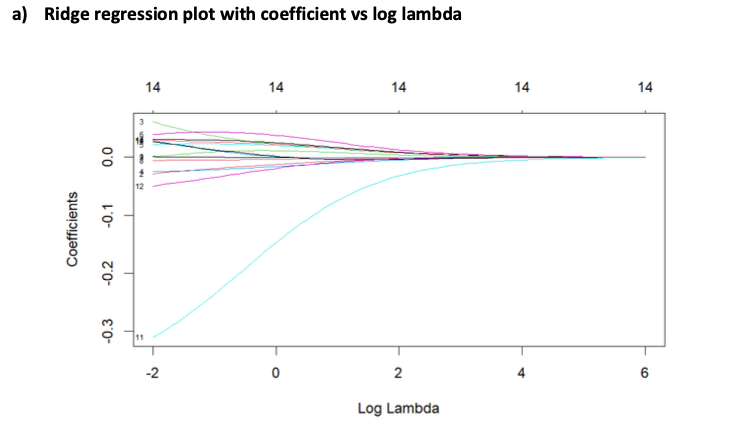

From figure 2, most of the variables show a decreasing trend in their coefficients as the L1 norm increases, but none of the variable shrink exactly to zero indicating that all the variables maintain some degree of influence in the model.
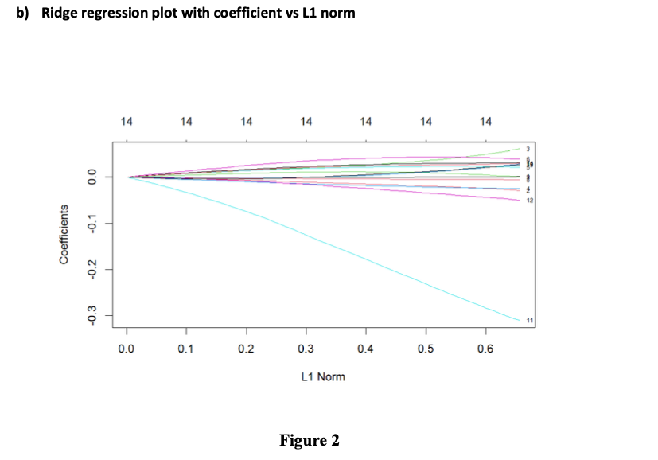

From figure 3, Max depth might be contributing less to the model as more variance is explained indicating it might not be as strong as others. The remaining variables' coefficients seem relatively stable across the range of the penalty, indicating that they have a consistent effect on the response variable regardless of the penalty strength.

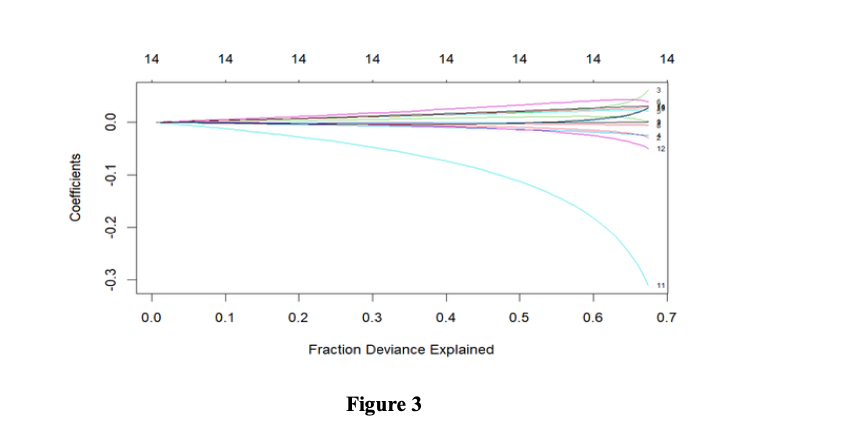

## Scaling of Predictors

From table 1, the various predictors and TN has various range of scale standard deviation indicating a diverse impact these predictors may have in the study.

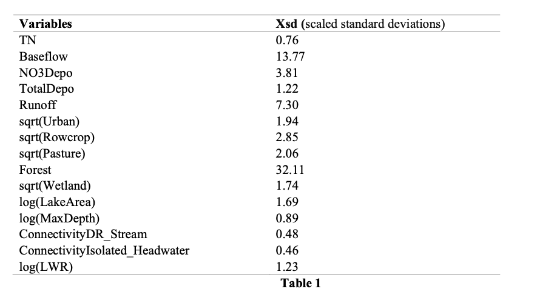

From figure 4, the differences in the coefficients' absolute values decrease, indicating a more
uniform shrinkage effect across all predictors. Some predictors have larger absolute values of coefficients at lower lambda, indicating they have a significant impact on the outcome when there's less regularization. The coefficient of the predictors decrease in absolute value as lambda increases, but none are reduced to zero, which is typical in ridge regression.

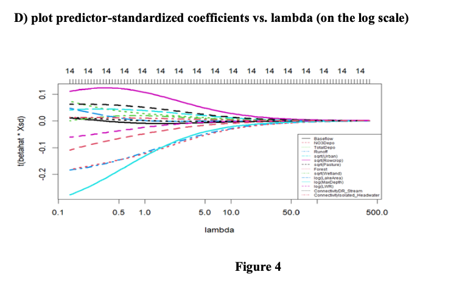

From figure 5, the plot indicate14 predictors but none of the coefficient is completely reduced to zero. Also, the coefficient shows that as the betaL2 scaled regularization increases the coefficient changes

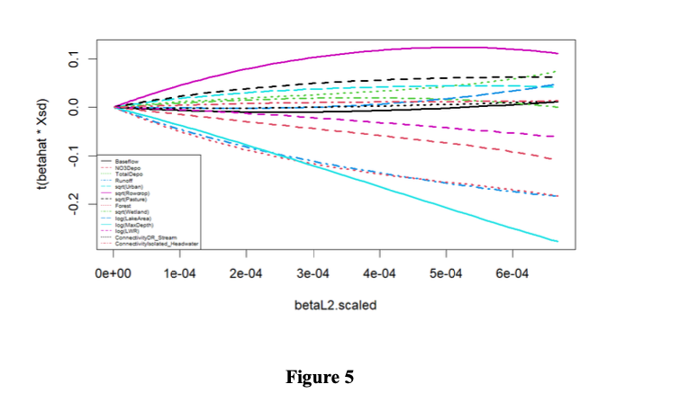

## Choosing Optimal Lambda Value

From figure 6 above, as the value of log(λ) increases, the MSE increases for a while before it starts to rise. The region where we have stability shows that this is where we have the optimal λ value where the model achieves the minimum of MSE. The plot depicts the mean squared prediction error MSE lambda against log lambda. The gray bar at each point show MSE lambda plus and minus one standard error. The first dashed lines shows the location of the minimum of MSE. The second dashed lines shows the largest lambda value such that the error is within 1 standard error. . The best lambda is given as 0.5346
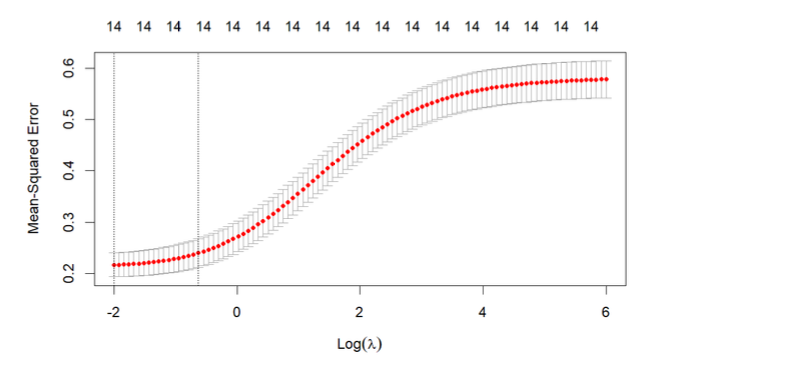

## Extracting the best model using K-cross validation
The negative mean prediction of -34.38 suggests that, on average, the model predicts a decrease or negative outcome for the response variable under average conditions of the predictors Negative coefficients for NO3Depo, Runoff, and log(MaxDepth) suggest that increases in these predictors are associated with decreases in the response variable, indicating potentially adverse effects. Positive coefficients for TotalDepo, sqrt(Urban), sqrt(Rowcrop), sqrt(Pasture), sqrt(Wetland), log(LakeArea), and both connectivity variables indicate that these factors are associated with increases in the response variable, suggesting beneficial or enhancing effects. Small magnitude coefficients, such as for Baseflow and Forest, imply a minimal impact on the response variable

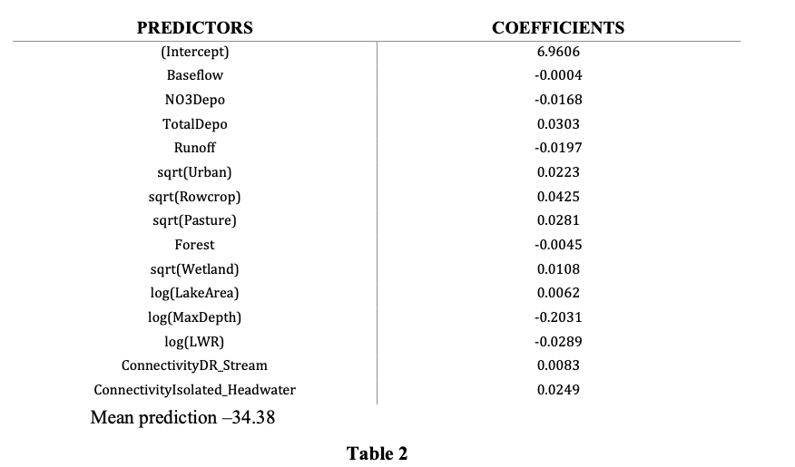

From the Ridge metrics in Table 3, 65.60% of the variability in the log (TN) response variable can be explained by the Lasso regression model above. The R square difference between the predicted variable and actual variable is 0.2205. On average the model prediction are 0.3671 units away from the actual value while the standard deviation of the prediction error is 0.4696

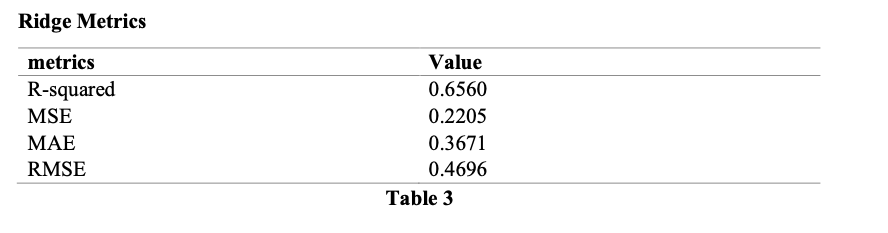

## Lasso Regression

In figure 7, the lasso regression plot suggests that while some predictors maintain their importance at different levels of regularization, others are more sensitive and become less influential in the model

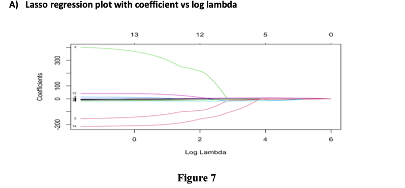

The plot reveals that the predictor "NO3depo" has the most significant positive coefficient, which decreases rapidly as lambda increases, suggesting it is sensitive to the regularization. "Baseflow" and "Runoff" have large negative coefficients that reduce with lambda, but more gradually. Predictors like "Urban," "Rowcrop," "Pasture," "Forest," "Lakearea," "MaxDepth," "ConnectivityDR_Stream," and "LWR" tend to have smaller and more stable coefficients. The number of non-zero coefficients decreases with increasing lambda, indicating a simpler model with fewer predictors. Overall, the plot suggests that some environmental factors have a more robust influence on the response variable than others in this Lasso regression model.

From figure 9, plot predictor-standardized coefficients vs. L1 norm of vector scaled to OLS fit. Some predictors, such as "Runoff," "Urban," and "Pasture," have relatively stable paths, suggesting that they are consistently important across different lambda values. "NO3depo" starts with a high positive coefficient that decreases quickly, indicating initial importance that diminishes with stronger regularization. "Baseflow" has a negative coefficient that also decreases in magnitude with regularization. Predictors like "Lakearea" and "Wetland" have coefficients that approach zero more quickly, suggesting they may be less important in the presence of regularization.

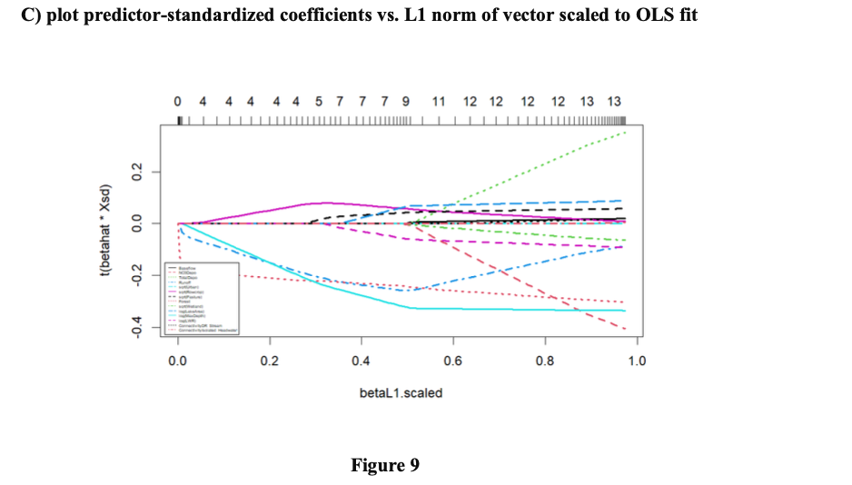

As lambda increases, the MSE initially decreases, reaching a minimum before starting to increase again. This pattern suggests that there is an optimal value of lambda that minimizes the MSE, thus providing the best balance between bias and variance in the model. The numbers at the top indicate the number of non-zero coefficients in the model at each lambda value. With higher lambda, the model becomes more regularized, resulting in fewer non-zero coefficients,
simplifying the model at the expense of potentially increasing the MSE. The lambda value that minimizes the test MSE turns out to be 0.094. The best lambda is given as 0.094

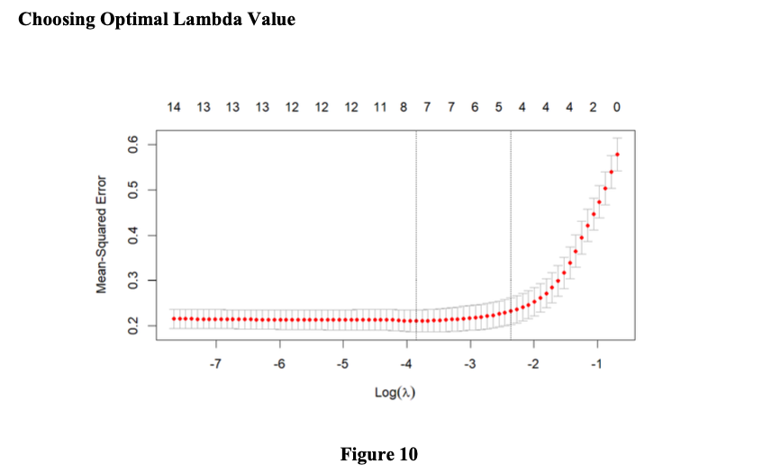

